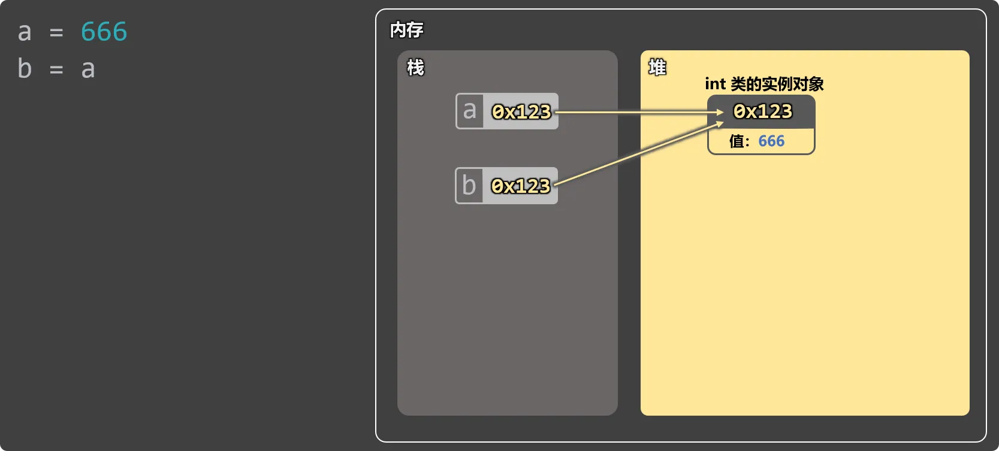
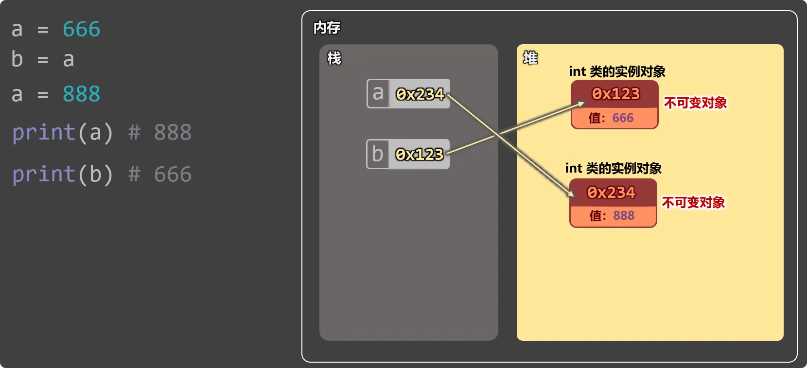
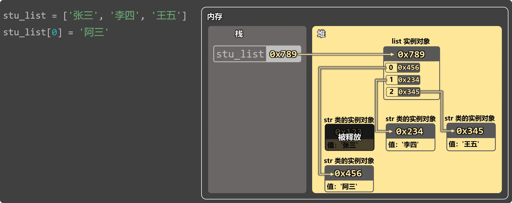
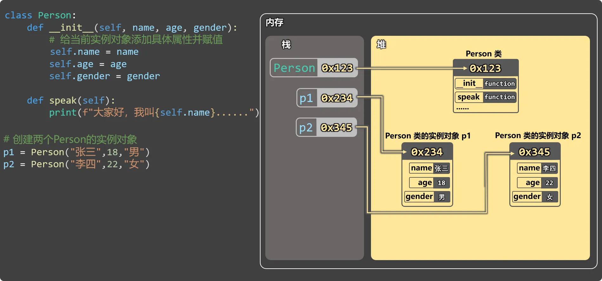

## 内存分为两个部分：栈内存、堆内存；变量在栈内存中，对象在堆内存中。
* 1️⃣Python 中变量里保存的不是存数据，而是指向堆中对象的引用（内存地址）。

* 2️⃣不可变对象：重新赋值会创建新对象  
int 类的实例对象，是不可变对象，所以修改变量 a 时，会创建新对象，不会影响其他引用（b）
Python 中常见的不可变对象有：int 、float 、bool 、str 、tuple 、frozenset 、None。
Python 中常见的可变对象有：list 、dict 、set 、自定义类的实例对象。

* 3️⃣ 可变对象：修改内容不改变地址

* 4️⃣自定义类对象的内存表示

